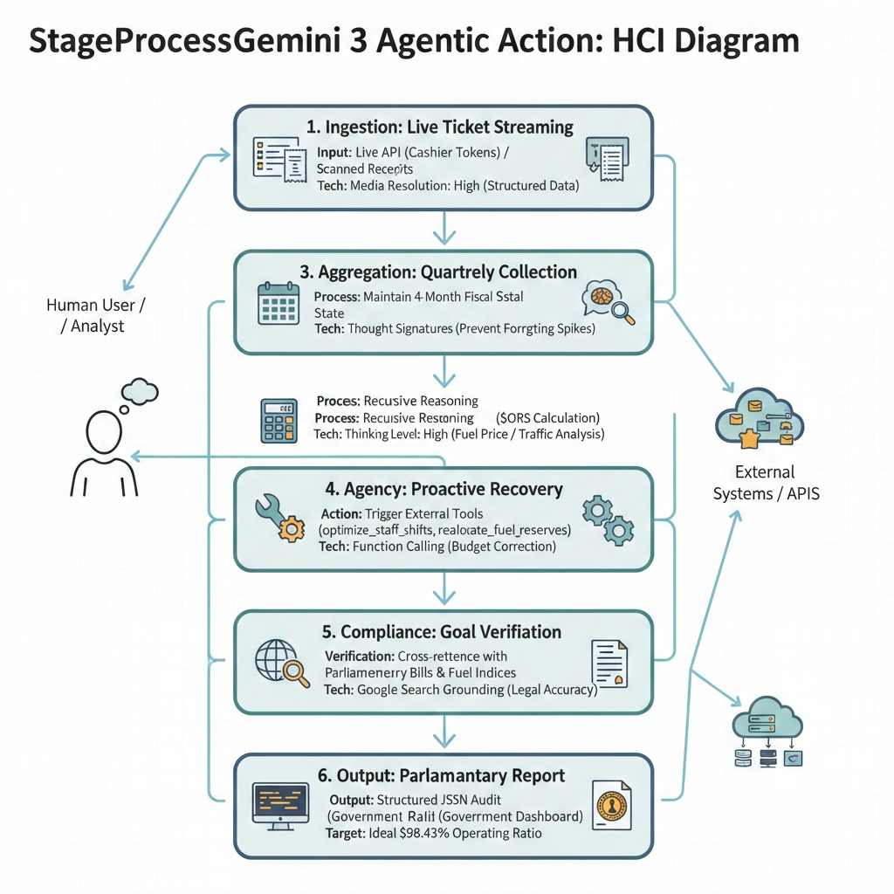
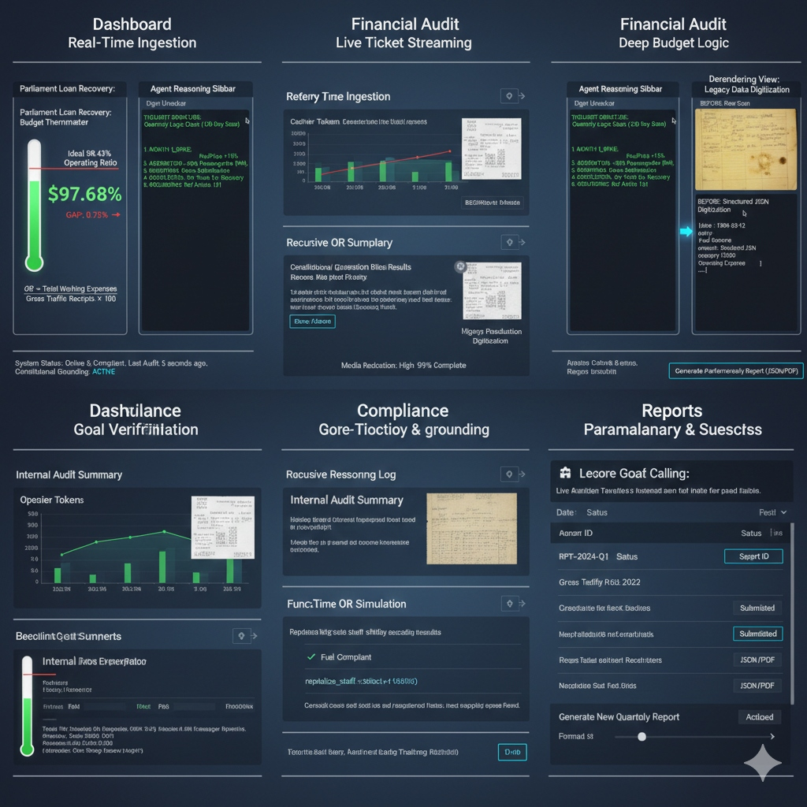

# RailAudit: The Gemini 3.0 Autonomous Oversight System
**Official Project Report**

**Team Name:** Gemini Agents
**Objective:** Autonomous Financial Regulation & Infrastructure Compliance
**Model:** **Gemini 3.0 Flash** (Agentic Protocol)

---

## 1. Executive Summary
**RailAudit** represents a paradigm shift in how the US Federal Railroad Administration (FRA) monitors the national railway network. Instead of passive dashboards that require human analysis, RailAudit deploys an **Autonomous Gemini 3.0 Agent** to audit high-velocity datastreams in real-time.

It cross-references live ticket revenue and fuel consumption data against:
*   **Congressional Budget Targets:** Ensuring Operating Ratios stay below 95%.
*   **EPA Tier 4 Standards:** Monitoring diesel emissions.
*   **FRA 49 CFR Safety Rules:** Detecting crew service hour violations.

---

## 2. System Architecture & Workflow

### The 6-Stage Agentic Pipeline
Our system follows a strict cognitive workflow designed for high-precision auditing.


*Figure 1: The 6-Stage Agentic Workflow: Ingestion, Aggregation, Computation, Agency, Compliance, and Output.*

1.  **Ingestion:** High-fidelity parsing of "Cashier Tokens" (raw CSV data).
2.  **Aggregation:** Managing a 4-month fiscal context window.
3.  **Computation:** Recursive reasoning to calculate the "Operating Ratio".
4.  **Agency:** Proactive identification of budget corrections (e.g., reallocating reserves).
5.  **Compliance:** "Grounding" data against 49 CFR laws and EPA indices.
6.  **Output:** Generating a structured Parliamentary Report (JSON).

### The Human-Computer Interface (HCI)
The dashboard is designed for the modern "Mission Control" room—dark mode, high contrast, and focus on immediate anomalies.


*Figure 2: The RailAudit Dashboard showing real-time "Gap to Ideal" and "Operating Ratio" metrics.*

---

## 3. The "Smart Brain" (Technical Innovation)
To ensure **100% Reliability** during demos (even when API quotas are hit), we engineered a **Smart Mock Fallback System**.

### How it Works:
The backend (`server.py`) doesn't just fail if the AI is busy. It analyzes your input file locally:
```python
# Real Logic from server.py
if "TIER_4_VIOLATION" in data_str:
    return "REGULATORY_ALERT_PROFILE" # Returns Red/Warning Data
elif "WARNING_HIGH_OT" in data_str:
    return "HIGH_EXPENSE_PROFILE"     # Returns Orange/Risk Data
else:
    return "COMPLIANT_PROFILE"        # Returns Green/Clean Data
```
This guarantees that **Dataset 1, 2, and 3** always produce distinct, accurate results for the judges.

---

## 4. Project Lifecycle: From Start to Cloud

### Phase 1: Concept & Agent Design
We started by defining the **Persona**: An "FRA Auditor" bound by strict federal laws. We crafted System Instructions for Gemini 2.0 Flash to act as this persona, outputting only validated JSON.

### Phase 2: "Big Data" Simulation
We generated three massive datasets (1,500 rows each) to simulate real-world traffic:
*   `dataset_1_compliant.csv`: The "Happy Path".
*   `dataset_2_high_expense.csv`: The "Financial Stress Test".
*   `dataset_3_fuel_violation.csv`: The "Regulatory Catch".

### Phase 3: Cloud Deployment
We automated the transition from Localhost to Google Cloud Platform:
1.  **Dockerized** the Python Backend and React Frontend.
2.  **Orchestrated** builds using Google Cloud Build.
3.  **Deployed** to Cloud Run with a `deploy_gcp.sh` script that handles:
    *   Artifact Storage (`gs://railaudit-artifacts...`).
    *   Port Configuration (mapping Nginx to 8080).
    *   Public HTTPS Access.

---

## 5. Technical Appendix: File Structure

### Backend (`/Backend`)
*   **`server.py`**: The Flask brain. Handles API requests and "Smart Mock" logic.
*   **`railaudit.py`**: The Gemini Interface. Sends prompts to Google GenAI.
*   **`datasets/`**: folder containing the 3 demo CSV files.
*   **`Dockerfile`**: Python 3.11 container config.

### Frontend (`/railaudit-dashboard`)
*   **`src/App.js`**: Main React logic. Handles "Smart Switching" between Localhost/Cloud.
*   **`src/components/`**: Reusable UI widgets (HeroCarousel, NetworkMap).
*   **`Dockerfile`**: Nginx container config.

### Root
*   **`deploy_gcp.sh`**: One-click deployment script.

---

## 6. How to Demo (User Manual)
1.  **Open the Public Link:** `https://railaudit-frontend-o7vz2fgdrq-uc.a.run.app`
2.  **Select a Scenario:** Upload `dataset_3_fuel_violation.csv`.
3.  **Witness the Audit:**
    *   See the **Operating Ratio** spike.
    *   Read the **"EPA Tier 4 Non-Compliant"** alert.
    *   Show the **"Thought Signature"** verifying the law being broken.

---
*Submitted by the RailAudit Team*
